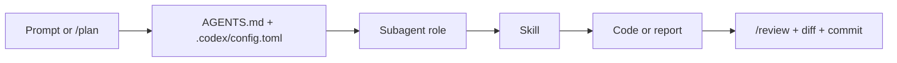

# codex-best-practice
practice makes codex better

-white?style=flat&labelColor=555)
<a href="https://github.com/DecentMakeover/codex-best-practice/stargazers"></a>
[](best-practice/)
[](#implemented-in-this-repo)
[](orchestration-workflow/orchestration-workflow.md)
[](#docs-map)

> README-first handbook for setting up Codex in a real repository.
> The goal is not to look like a landing page. The goal is to make Codex easy to understand, easy to copy, and hard to misuse.

## CONCEPTS

| Feature | Location | Description |
|---------|----------|-------------|
| [**Slash commands**](https://developers.openai.com/codex/cli/slash-commands/) | built-in | Codex's built-in control surface. Think `/plan`, `/review`, `/mcp`, `/apps`, `/status`, `/fork`, and `/resume`. Unlike Claude Code, repo-defined custom slash commands are not the main extension mechanism here. |
| [**Subagents**](https://developers.openai.com/codex/multi-agent/) | [`.codex/agents/<name>.toml`](.codex/agents/) | [Best practice](best-practice/codex-subagents.md) · [Implemented](.codex/agents/) Specialized roles for bounded parallel work. Good for research, review, and verification without bloating the main thread. |
| [**Skills**](https://developers.openai.com/codex/skills) | [`.agents/skills/<name>/SKILL.md`](.agents/skills/) | [Best practice](best-practice/codex-skills.md) · [Implemented](.agents/skills/) Reusable workflow packages with progressive disclosure. Best for repeated tasks that should stop living in giant prompts. |
| [**AGENTS.md**](https://developers.openai.com/codex/guides/agents-md/) | [`AGENTS.md`](AGENTS.md) | [Best practice](best-practice/codex-agents-md.md) · [Implemented](AGENTS.md) Persistent repository guidance: how to run the repo, what to avoid, and what “done” means. |
| [**Config**](https://developers.openai.com/codex/config-reference/) | [`.codex/config.toml`](.codex/config.toml) | [Best practice](best-practice/codex-config.md) · [Implemented](.codex/config.toml) Layered TOML defaults for model, reasoning, approvals, sandboxing, profiles, apps, and MCP. |
| [**MCP**](https://developers.openai.com/codex/mcp) | `.codex/config.toml` → `[mcp_servers.*]` | [Best practice](best-practice/codex-mcp.md) · [Implemented](.codex/config.toml) Connect live docs, browser tools, and external systems instead of pasting unstable context into prompts. |
| [**Plugins**](https://developers.openai.com/codex/plugins) | `.codex-plugin/plugin.json` | Installable bundles for distributing skills, apps, and MCP setup across teams or projects. |
| [**Apps / Connectors**](https://developers.openai.com/codex/cli/slash-commands/#browse-apps-with-apps) | `/apps`, `config.toml` → `[apps.*]` | Connected tools from ChatGPT surfaced inside Codex. Useful when work crosses GitHub, Gmail, Drive, Slack, and other systems. |
| [**Automations**](https://developers.openai.com/codex/app/automations/) | Codex app | Stable background tasks that run on a schedule. Skills define the method; automations define the cadence. |
| [**Review**](https://developers.openai.com/codex/learn/best-practices/#improve-reliability-with-testing-and-review) | `/review`, diff view | Codex can review working tree changes, flag regressions, and follow repo-specific review guidance referenced from `AGENTS.md`. |
| [**Workflows**](orchestration-workflow/orchestration-workflow.md) | `AGENTS.md` + `.codex/config.toml` + skills + agents | [Workflow note](orchestration-workflow/orchestration-workflow.md) Codex orchestration is usually built from built-in slash commands plus durable repo files, not custom repo-local commands. |

## HOT RIGHT NOW

| Feature | Why it matters |
|---------|----------------|
| [**Multi-agent**](https://developers.openai.com/codex/multi-agent/) | Codex can spawn specialized subagents, route follow-up work, and synthesize their output back into the main thread. |
| [**Automations**](https://developers.openai.com/codex/app/automations/) | Once a workflow is predictable, you can schedule it in the Codex app and keep recurring maintenance out of your head. |
| [**Apps / Connectors**](https://developers.openai.com/codex/app/) | Codex can work with connected systems instead of treating your repo as the entire world. |
| [**Fast mode**](https://developers.openai.com/codex/cli/slash-commands/#toggle-fast-mode-with-fast) | Good when iteration speed matters more than maximum reasoning depth. |
| [**Cloud tasks**](https://developers.openai.com/codex/quickstart/) | Codex can also run in the cloud at `chatgpt.com/codex`, not only locally in the CLI or app. |
| [**Review loops**](https://developers.openai.com/codex/learn/best-practices/#improve-reliability-with-testing-and-review) | `/review`, diff inspection, and PR review patterns are central to making Codex reliable instead of merely fast. |

## ORCHESTRATION WORKFLOW

The reference Claude repo uses a strong **Command → Agent → Skill** pattern.

For Codex, the more accurate equivalent is usually:



Codex does not currently depend on repo-defined custom slash commands the way the Claude repo does. The reliable Codex version of the pattern is:

1. Use a built-in command like `/plan` or `/review` when it helps.
2. Put durable repo behavior in `AGENTS.md`.
3. Put deterministic defaults in `.codex/config.toml`.
4. Use a subagent for bounded sidecar work.
5. Use a skill when the workflow repeats.

See [orchestration-workflow/orchestration-workflow.md](orchestration-workflow/orchestration-workflow.md) for the repo-specific example.

## IMPLEMENTED IN THIS REPO

| Artifact | Path | Purpose |
|----------|------|---------|
| Repo instructions | [`AGENTS.md`](AGENTS.md) | Shows what a short, operational `AGENTS.md` looks like in a docs repo. |
| Project config | [`.codex/config.toml`](.codex/config.toml) | Model, approvals, sandbox, multi-agent, and docs MCP defaults. |
| Research role | [`.codex/agents/researcher.toml`](.codex/agents/researcher.toml) | Read-only role for documentation gathering and source inspection. |
| Review role | [`.codex/agents/reviewer.toml`](.codex/agents/reviewer.toml) | Read-only role for reviewing diffs and looking for regressions. |
| Skill example | [`.agents/skills/release-notes/SKILL.md`](.agents/skills/release-notes/SKILL.md) | Reusable workflow for drafting release notes from commits or PRs. |
| Skill reference | [`.agents/skills/release-notes/references/outline.md`](.agents/skills/release-notes/references/outline.md) | Example of progressive disclosure support material. |
| Skill catalog | [`docs/SKILLS.md`](docs/SKILLS.md) | Human-readable inventory of what the repo includes. |
| Handbook docs | [`best-practice/`](best-practice/) | Markdown deep dives for AGENTS.md, config, skills, subagents, and MCP. |
| Workflow note | [`orchestration-workflow/orchestration-workflow.md`](orchestration-workflow/orchestration-workflow.md) | Explains the Codex equivalent of the Claude orchestration pattern. |

## STARTER TREE

```text
.
├── README.md
├── index.html
├── AGENTS.md
├── .codex/
│   ├── config.toml
│   └── agents/
│       ├── researcher.toml
│       └── reviewer.toml
├── .agents/
│   └── skills/
│       └── release-notes/
│           ├── SKILL.md
│           └── references/
│               └── outline.md
├── best-practice/
│   ├── README.md
│   ├── codex-agents-md.md
│   ├── codex-config.md
│   ├── codex-mcp.md
│   ├── codex-skills.md
│   └── codex-subagents.md
├── docs/
│   └── SKILLS.md
└── orchestration-workflow/
    └── orchestration-workflow.md
```

## HOW TO USE

```bash
codex
> /plan Inspect this repo and tell me which AGENTS.md, config, skills, and agents I should copy into my own project first.
```

Recommended order:

1. Copy `AGENTS.md` and rewrite it for your repo, not this one.
2. Copy `.codex/config.toml` and trim it to the defaults your team will actually use.
3. Add one skill for a workflow you already repeat.
4. Add one read-only subagent role for research or review.
5. Add MCP only when you are clearly losing time to copy-paste.

## TIPS AND TRICKS

### Planning

- Start with `/plan` for anything multi-step or ambiguous.
- Put **goal**, **context**, **constraints**, and **done-when** in the opening prompt.
- Keep one Codex thread per coherent task; fork when you truly branch.

### AGENTS.md / Config

- Keep `AGENTS.md` short and operational.
- Put deterministic defaults in `config.toml`, not in prose instructions.
- `workspace-write` + `on-request` is a strong default for most trusted repos.

### Skills

- Create a skill when you repeat a workflow often enough to notice the pattern.
- Write the skill description as a trigger boundary, not a marketing summary.
- Start instruction-only. Add scripts or MCP dependencies only when reliability clearly improves.

### Subagents

- Delegate bounded sidecar work, not the entire critical path.
- Keep research and review roles read-only by default.
- Use subagents to preserve main-thread clarity, not to feel “more agentic.”

### MCP / Review

- Add live tools only when stale context is slowing you down.
- `openaiDeveloperDocs` is a very strong first MCP server.
- Use `/review` before commit and treat concrete findings as requirements.

### Daily

- Update Codex regularly and read the changelog when major features land.
- When Codex makes the same mistake twice, either improve `AGENTS.md` or create a skill.
- Keep the codebase clean; half-finished migrations confuse models.

## DOCS MAP

- [Codex overview](https://developers.openai.com/codex/overview)
- [Best practices](https://developers.openai.com/codex/learn/best-practices/)
- [AGENTS.md guide](https://developers.openai.com/codex/guides/agents-md/)
- [Configuration reference](https://developers.openai.com/codex/config-reference/)
- [Slash commands](https://developers.openai.com/codex/cli/slash-commands/)
- [Skills](https://developers.openai.com/codex/skills)
- [Multi-agent](https://developers.openai.com/codex/multi-agent/)
- [MCP](https://developers.openai.com/codex/mcp)
- [Plugins](https://developers.openai.com/codex/plugins)
- [Automations](https://developers.openai.com/codex/app/automations/)
- [Quickstart](https://developers.openai.com/codex/quickstart/)

## NOTE ON SCOPE

This repo is intentionally closer to the reference README than to a product landing page.

If you want the GitHub page and the repo front page to feel aligned, treat the repo as the source of truth:

- `README.md` explains the system
- the repo files show the implementation
- the GitHub Pages `index.html` mirrors the handbook in a more browseable format
